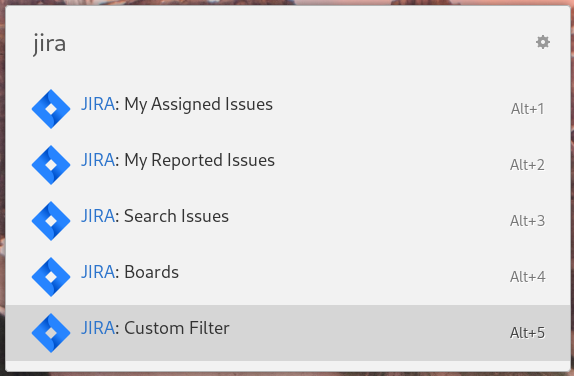

# Ulauncher JIRA Extension

> Quickly access your [JIRA](https://www.atlassian.com/software/jira) Issues, Boards and more, directly from [Ulauncher](https://ulauncher.io/).

[](https://ext.ulauncher.io/)
[](https://github.com/brpaz/ulauncher-jira)
[](https://github.com/brpaz/ulauncher-jira/blob/master/LICENSE)


## Demo



## Requirements

* [Ulauncher](https://github.com/Ulauncher/Ulauncher) > 5.0
* Python >= 3

## Getting started

### Pre-Requesities

This extensions require a few Python packages to work.

You can install them, using `pip`.

Ex:

```bash
pip install -r https://raw.githubusercontent.com/brpaz/ulauncher-jira/main/requirements.txt
```

### Install the extension


Open ulauncher preferences window -> extensions -> add extension and paste the following url:

```
https://github.com/brpaz/ulauncher-jira
```

### Configure settings

Before being able to use this extension, you must configure a few settings with your JIRA account credentials. Open Ulauncher Preferences and input the following settings:

- **server_url** - Your JIRA server URL.
- **email** - Your user email
- **access_token** - Your JIRA API Token. (For Jira Cloud, you can create your token [here](https://id.atlassian.com/manage-profile/security/api-tokens))


## Usage

This extension provides a few keywords, including:

- `jira:assigned` - Lists all your assgined JIRA issues
- `jira:reported` - Lists all your reported JIRA issues
- `jira:search` - Search JIRA Issues
- `jira:boards`  - Lists all the JIRA boards
- `jira:filter` - Allow custom filters queries using [JQL](https://support.atlassian.com/jira-service-management-cloud/docs/use-advanced-search-with-jira-query-language-jql/).

### Custom JQL filters

This extemsion allows you to create shortcuts for custom JQL filters. For create your own filters, edit the `~/.config/ulauncher/com.github.brpaz.ulauncher-jira/filters.yaml` and you should be able to execute then in the `JIRA: Custom Filters` menu in the extension.


## Development

```
git clone https://github.com/brpaz/ulauncher-jira
make link
```

The `make link` command will symlink the cloned repo into the appropriate location on the ulauncher extensions folder.

To see your changes, stop ulauncher and run it from the command line with: `make dev`.

## Contributing

Contributions are what make the open source community such an amazing place to be learn, inspire, and create. Any contributions you make are **greatly appreciated**.

1. Fork the Project
2. Create your Feature Branch (`git checkout -b feature/AmazingFeature`)
3. Commit your Changes (`git commit -m 'Add some AmazingFeature'`)
4. Push to the Branch (`git push origin feature/AmazingFeature`)
5. Open a Pull Request

## 💛 Support the project

If this project was useful to you in some form, I would be glad to have your support.  It will help to keep the project alive and to have more time to work on Open Source.

The sinplest form of support is to give a ⭐️ to this repo.

You can also contribute with [GitHub Sponsors](https://github.com/sponsors/brpaz).

[](https://github.com/sponsors/brpaz)

Or if you prefer a one time donation to the project, you can simple:

<a href="https://www.buymeacoffee.com/Z1Bu6asGV" target="_blank"></a>

---
## License

MIT &copy; Bruno Paz
